# CinemaAppCorrectedVersion
# CinemaApp
Для хранения информации было принято решение написать базу данных и для взаимодействия использовать SQLite(согласовано с семинаристом)
Для взаимодействия с базой данных в kotlin надо подключить в зависимости проекта драйвер jdbc(он уже скачен и лежит в проекте в папке lib)
# Вот как это сделать:
1. Открываете проект в IDEA
2. Нажимаете правой кнопкой мыши на проект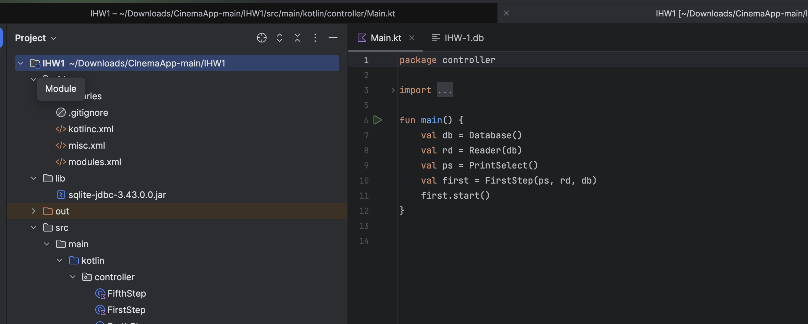
3. Выбираете пункт "Open Module Settings"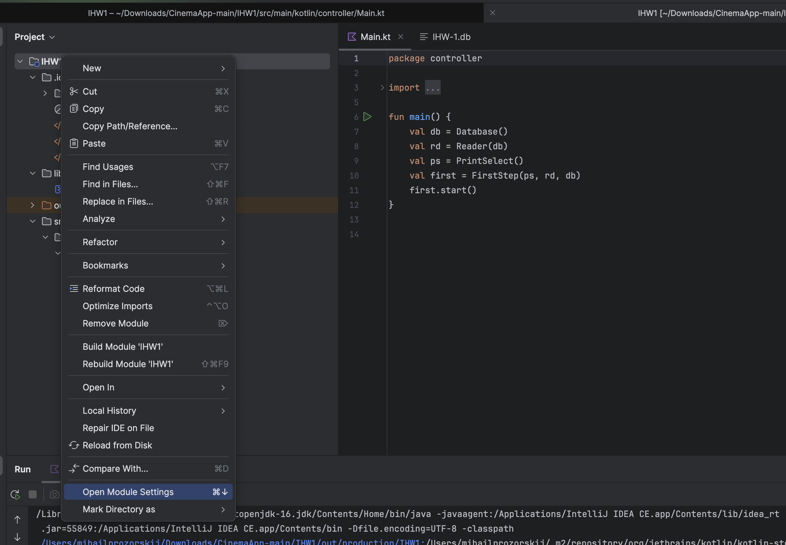
4. Выбираете пункт "Dependencies"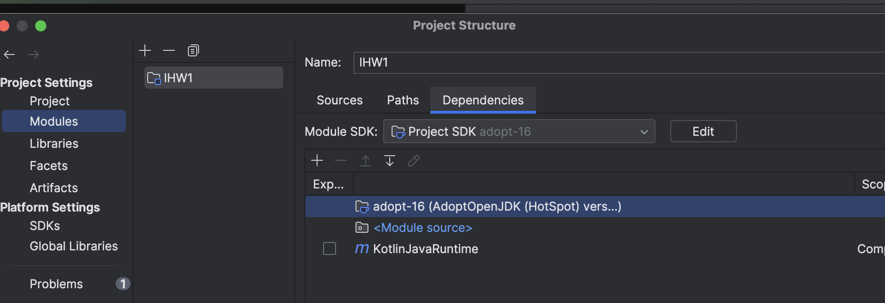
5. Нажимаете на +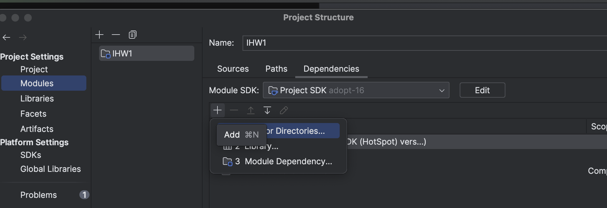
6. Выбираете "Jars or ..."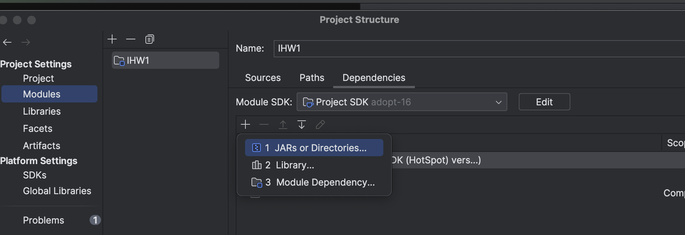
7. Выбираете rdbc драйвер(называется sqlite-jdbc-3.43.0.0.jar)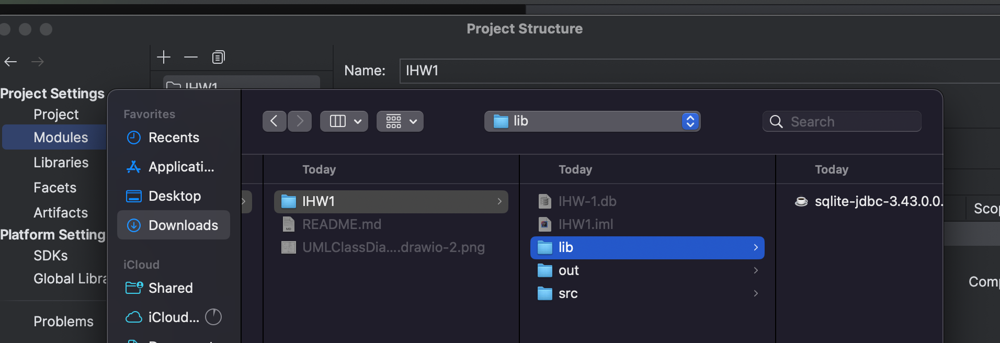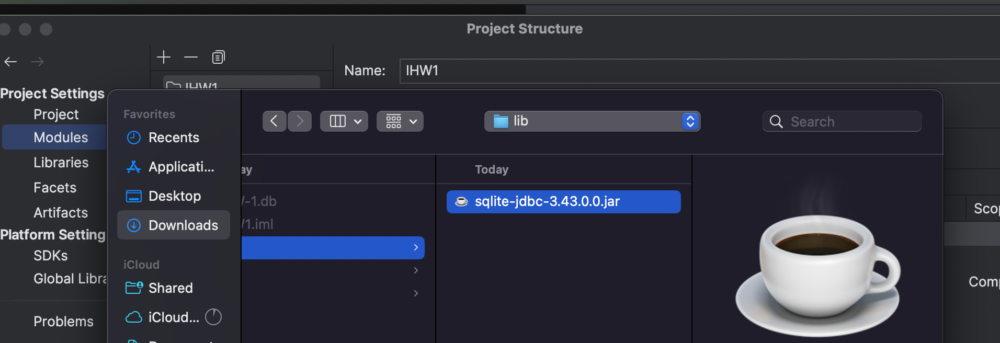
8. Нажимаете OK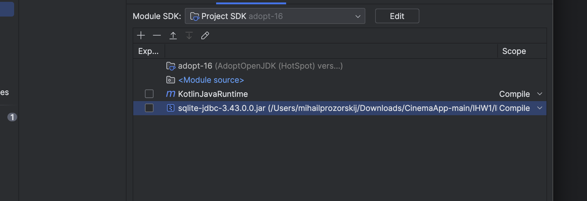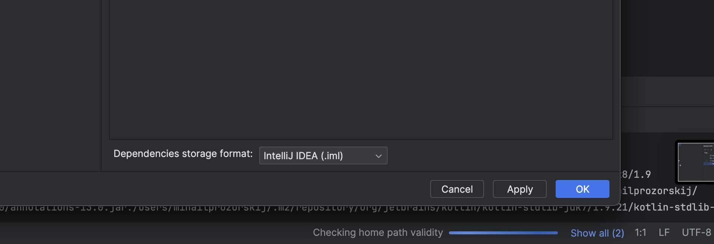

# Как пользоваться приложением:
При запуске пользователю предлагается выбор:

1 - Регистрация

2 - Авторизация 

0 - Остановить приложение(приложение завершает свою работу)

При остальных двух выборах пользователь вводит своё пользовательское имя и пароль, который шифруется. Если это регистрация, то программа проверяет, есть ли в бд пользователь с таким именем и если нет, то добавляет его в бл, если есть, то сообщает пользователю и снова предлагает тот же выбор. Если это авторизация, то программа ищет пользователя в бд, если не находит, то сообщает пользователю и возвращает его к предыдущему выбору. Если находит, то сравнивает пароль в бд с хешированной строкой введенного пользователем пароля, если не сходятся, то программа сообщает об этом пользователю и возвращает его к первому выбору, если сходятся, то выдаётся сообщение All right и пользователю предлагают выбор:

1 - Удалить аккаунт(при выборе пункта, аккаунт пользователя удаляется, а сам пользователь возвращается к первому выбору)

2 - Работать с фильмами(описание ниже)

3 - Вывести всех работников(выводятся все зарегистрированные аккаунты, после чего пользователю снова предлагается этот выбор)

4 = Назад(пользователь возвращается к предыдущему выбору)

При выборе работать с фильмами пользователю открывается выбор:

1 - Добавить фильм(пользователь вводит название и длительность, после чего возвращается к этому же выбору)

2 - Вывести фильмы(выводятся все фильмы, которые есть у кинотеатра, после чего пользователь возвращается к этому же выбору)

3 - Выбрать фильм(описание ниже)

4 - Вывести сеансы(выводятся все сеансы, которые ещё не закончились, после чего пользователь возвращается к этому же выбору)

5 - Вывести историю сеансов(выводятся все сеансы которые есть, были и будут, после чего пользователь возвращается к этому же выбору)

0 - Назад(возвращает пользователя к предыдущему выбору)

При выборе пункта выбрать фильм пользователю предлагают выбрать один фильм из всех, что есть у кинотеатра, после выбора пользователю предлагается выбрать действие с этим фильмом:

1 - Изменить продолжительность(пользователь вводит новое значение, если изменение вызывает накладки в расписании, то ничего не меняется, а пользователь получает соответствующее сообщение, после чего пользователь возвращается к этому же выбору. Если же накладок не происходит, то введенное значение задается фильму и меняется расписание, после чего пользователь возвращается к этому же выбору)

2 - Удалить фильм(удаляет фильм и все его сеансы, после чего пользователь возвращается к предыдущему выбору)

3 - Добавить сеанс(пользователь вводит значения, если добавление проходит успешно, то пользователь получает сообщение об этом и возвращается к этому же выбору. Иначе пользователь получает соответствующее сообщение об ошибке, после чего возвращается к этому же выбору)

4 - Вывести сеансы фильма(выводятся все сеансы этого фильма, которые ещё не закончились, после чего пользователь возвращается к этому же выбору)

5 - Вывести историю сеансов фильма(выводятся все сеансы этого фильма которые есть, были и будут, после чего пользователь возвращается к этому же выбору)

6 - Выбрать сеанс фильма(описание ниже)

0 - Назад(возвращает пользователя к предыдущему выбору)

При выборе пункта выбрать сеанс фильма пользователю предлагают выбрать один сеанс фильма из всех, что будут или идут сейчас, после выбора пользователю предлагается выбрать действие с этим сеансом:

1 - Изменить время начала сеанса(пользователь вводит новое значение, если изменение вызывает накладки в расписании, то ничего не меняется, а пользователь получает соответствующее сообщение, после чего пользователь возвращается к этому же выбору. Если же накладок не происходит, то введенное значение задается сеансу и меняется расписание, после чего пользователь возвращается к этому же выбору)

2 - Удалить сеанс(Удаляет сеанс и все билеты на него, после чего пользователь возвращается к этому же выбору)

3 - Продать билет на сеанс(Пользователь вводит номер места. Если продажа проходит успешно, то пользователь получает сообщение об этом и возвращается к этому же выбору. Иначе пользователь получает соответствующее сообщение об ошибке, после чего возвращается к этому же выбору)

4 - Вывести свободные и занятые места(Выводит модель зала, отмечая места f - свободные и t - занятые)

5 - Вернуть(отменить) билет на сеанс(Удаляет билет, если сеанс еще не начался. Если операция проходит успешно, то пользователь получает сообщение об этом и возвращается к этому же выбору. Иначе пользователь получает соответствующее сообщение об ошибке, после чего возвращается к этому же выбору

0 - Назад(возвращает пользователя к предыдущему выбору)

# UML Diagrams:
## Class Diagram:
(классы наследники абстрактных не отображены, так как логика та же, а их очень много)
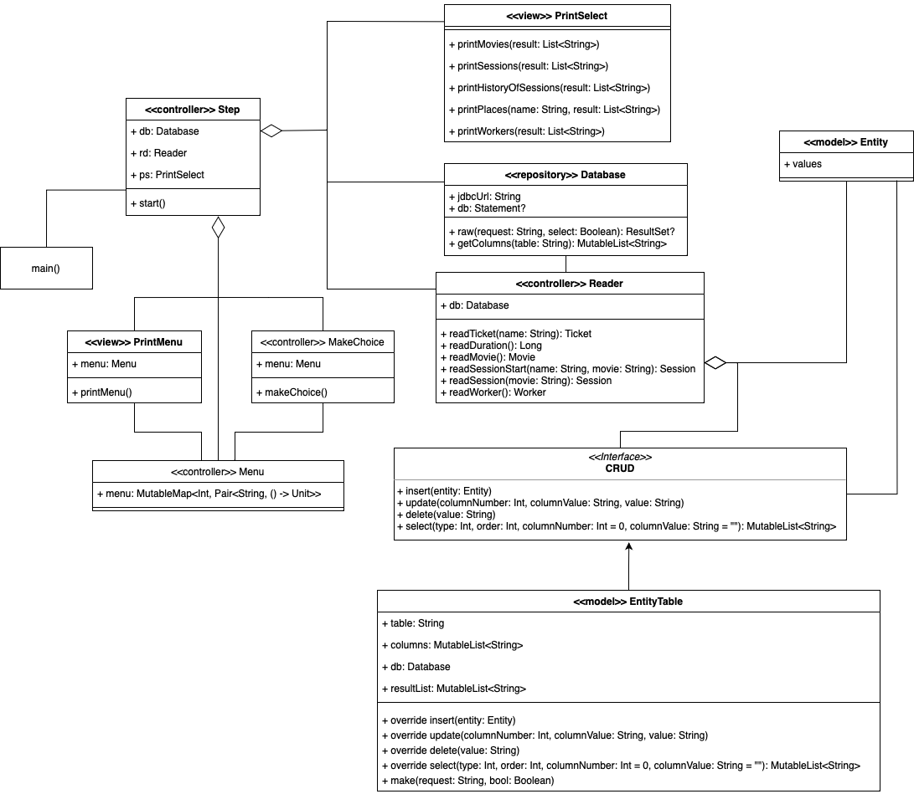
## Use Case:
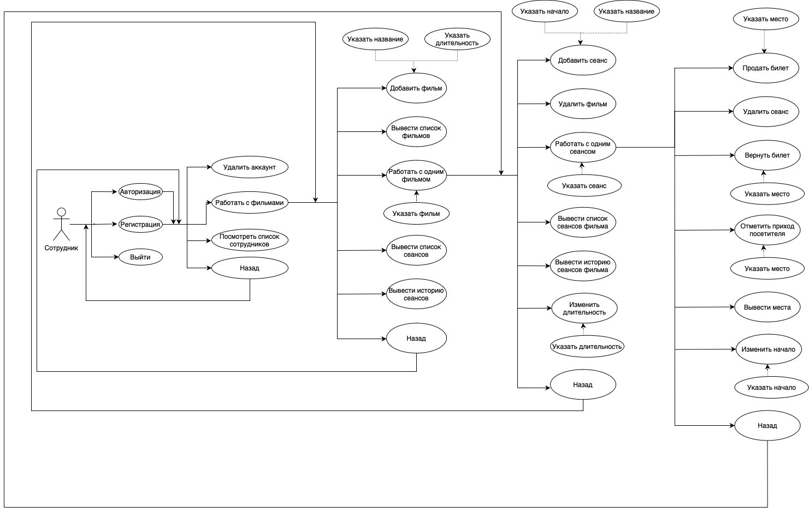
